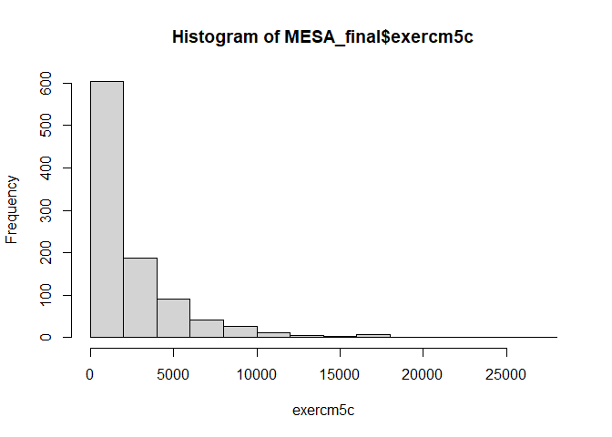
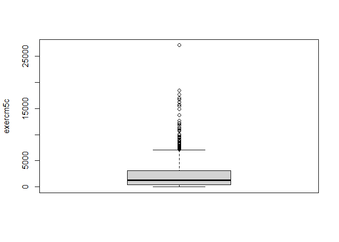

Table 1
================

``` r
MESA_final <- readRDS("MESA_final.rds")
```

### Tabulation

#### Gender

0: female  
1: Male

``` r
table(MESA_final$gender1)
```

    ## 
    ##   0   1 
    ## 521 463

``` r
prop.table(table(MESA_final$gender1))
```

    ## 
    ##         0         1 
    ## 0.5294715 0.4705285

#### Nativity

1: One of 50 US states  
2: Puerto Rico  
3: Another country

``` r
table(MESA_final$bth1)
```

    ## 
    ##   1   2   3 
    ## 339 110 535

``` r
prop.table(table(MESA_final$bth1))
```

    ## 
    ##         1         2         3 
    ## 0.3445122 0.1117886 0.5436992

#### Nationality

Mexican, Chicano, Mexican-American  
0: No  
1: Yes

``` r
table(MESA_final$mexican1)
```

    ## 
    ##   0   1 
    ## 477 505

``` r
prop.table(table(MESA_final$mexican1))
```

    ## 
    ##         0         1 
    ## 0.4857434 0.5142566

Dominican  
0: N  
1: Y

``` r
table(MESA_final$dominic1)
```

    ## 
    ##   0   1 
    ## 843 139

``` r
prop.table(table(MESA_final$dominic1))
```

    ## 
    ##         0         1 
    ## 0.8584521 0.1415479

Puerto Rican  
0: No  
1: yes

``` r
table(MESA_final$puert1)
```

    ## 
    ##   0   1 
    ## 841 141

``` r
prop.table(table(MESA_final$puert1))
```

    ## 
    ##         0         1 
    ## 0.8564155 0.1435845

Cuban  
0: No  
1: Yes

``` r
table(MESA_final$cuban1)
```

    ## 
    ##   0   1 
    ## 946  36

``` r
prop.table(table(MESA_final$cuban1))
```

    ## 
    ##          0          1 
    ## 0.96334012 0.03665988

Other Hispanic  
0: No  
1: Yes

``` r
table(MESA_final$othhisp1)
```

    ## 
    ##   0   1 
    ## 848 134

``` r
prop.table(table(MESA_final$othhisp1))
```

    ## 
    ##         0         1 
    ## 0.8635438 0.1364562

#### Language spoken at home

1: ENGLISH  
2: SPANISH  
3: CANTONESE  
4: MANDARIN  
5: OTHER

``` r
table(MESA_final$langhm1)
```

    ## 
    ##   1   2   5 
    ## 118 214   1

``` r
prop.table(table(MESA_final$langhm1))
```

    ## 
    ##           1           2           5 
    ## 0.354354354 0.642642643 0.003003003

#### Language spoken at Exam 1

1: English  
2: Spanish  
3: Chinese

``` r
table(MESA_final$lang1)
```

    ## 
    ##   1   2 
    ## 498 486

``` r
prop.table(table(MESA_final$lang1))
```

    ## 
    ##         1         2 
    ## 0.5060976 0.4939024

#### Geographic Location

3: WFU = Winston-Salem, NC 4: COL = New York, NY  
5: JHU = Baltimore, MD  
6: UMN = Minneapolis, MN  
7: NWU = Chicago, IL  
8: UCLA = Los Angeles, CA

``` r
table(MESA_final$site5c)
```

    ## 
    ##   3   4   6   8 
    ##   2 363 322 297

``` r
prop.table(table(MESA_final$site5c))
```

    ## 
    ##          3          4          6          8 
    ## 0.00203252 0.36890244 0.32723577 0.30182927

#### Cigarette Smoking Status

0: Never  
1: Former  
2: Current

``` r
table(MESA_final$cig5c)
```

    ## 
    ##   0   1   2 
    ## 457 457  70

``` r
prop.table(table(MESA_final$cig5c))
```

    ## 
    ##          0          1          2 
    ## 0.46443089 0.46443089 0.07113821

#### Hypertension

0: No  
1: Yes

``` r
table(MESA_final$htn5c)
```

    ## 
    ##   0   1 
    ## 386 597

``` r
prop.table(table(MESA_final$htn5c))
```

    ## 
    ##         0         1 
    ## 0.3926755 0.6073245

#### Current Alcohol Consumption

``` r
table(MESA_final$curalc5)
```

    ## 
    ##   0   1 
    ## 692 286

``` r
prop.table(table(MESA_final$curalc5))
```

    ## 
    ##         0         1 
    ## 0.7075665 0.2924335

#### Diabetes at Exam 5

“Exam 5 Diabetes Mellitus by 2003 ADA Fasting Criteria Algorithm”  
0: Normal  
1: IFG (“impaired fasting glucose”)  
2: Diabetes

``` r
table(MESA_final$dm035c_recode)
```

    ## 
    ##   0   1   2 
    ## 474 243 261

``` r
prop.table(table(MESA_final$dm035c_recode))
```

    ## 
    ##         0         1         2 
    ## 0.4846626 0.2484663 0.2668712

*Question*: Should I create new variable combining Normal and IFG as “no
diabetes” and untrested diabetes and treated diabetes as “diabetes”?

### Mean & SDs

Age

``` r
mean(MESA_final$age5c, na.rm = TRUE)
```

    ## [1] 69.20224

``` r
sd(MESA_final$age5c, na.rm = TRUE)
```

    ## [1] 9.561003

BMI

``` r
mean(MESA_final$bmi5c, na.rm = TRUE)
```

    ## [1] 29.76487

``` r
sd(MESA_final$bmi5c, na.rm = TRUE)
```

    ## [1] 5.620989

Average intentional exercises, minutes per week

``` r
mean(MESA_final$exercm5c, na.rm = TRUE)
```

    ## [1] 2373.951

``` r
sd(MESA_final$exercm5c, na.rm = TRUE)
```

    ## [1] 3006.318

- The mean and SD for Average intentional exercises, minutes per week
  seems a little off. Here is the distribution for the variable ot
  understand if there are any outliers or issues with the data:

``` r
hist(MESA_final$exercm5c, xlab = "exercm5c")
```

<!-- -->

``` r
boxplot(MESA_final$exercm5c, ylab = "exercm5c")
```

<!-- -->

``` r
Q1 = quantile(MESA_final$exercm5c, 0.25, na.rm = TRUE)
Q3 = quantile(MESA_final$exercm5c, 0.75, na.rm = TRUE)
IQR_value = IQR(MESA_final$exercm5c, na.rm = TRUE)

lower_threshold = Q1 - 1.5 * IQR_value
upper_threshold = Q3 + 1.5 * IQR_value

outliers = MESA_final$exercm5c[MESA_final$exercm5c < lower_threshold | MESA_final$exercm5c > upper_threshold]

print(outliers)
```

    ##  [1]  8417.5 16237.5  8520.0 10732.5  8715.0  8280.0 11025.0  8242.5  7140.0
    ## [10] 17715.0 16987.5  8085.0  7207.5 15435.0  9870.0 10010.0  8820.0 11010.0
    ## [19]  9120.0 27075.0  8160.0  7320.0  9600.0  7892.5  8400.0  7605.0 12090.0
    ## [28]  9030.0 11760.0  8190.0  7560.0  8085.0 12100.0      NA  7507.5      NA
    ## [37] 12300.0  7560.0      NA 18427.5  8490.0  9555.0 12630.0  9052.5  9015.0
    ## [46]      NA  7275.0  9390.0  9000.0      NA  7905.0  7425.0  7200.0  8790.0
    ## [55] 16680.0 11175.0 10800.0 13740.0      NA 16192.5 16972.5  9540.0  7447.5
    ## [64] 11382.5 11040.0 14910.0 10687.5  9450.0 15765.0 16252.5  8505.0  9360.0
    ## [73]  7290.0      NA  7635.0 11445.0  9555.0  7657.5

Average age of diabetes diagnosis, yrs

``` r
mean(MESA_final$dmage, na.rm = TRUE)
```

    ## [1] 62.97867

``` r
sd(MESA_final$dmage, na.rm = TRUE)
```

    ## [1] 10.8979

Average LDL cholesterol

``` r
mean(MESA_final$ldl5, na.rm = TRUE)
```

    ## [1] 104.3226

``` r
sd(MESA_final$ldl5, na.rm = TRUE)
```

    ## [1] 32.65871

Average HDL cholesterol

``` r
mean(MESA_final$hdl5, na.rm = TRUE)
```

    ## [1] 51.31934

``` r
sd(MESA_final$hdl5, na.rm = TRUE)
```

    ## [1] 14.52656

Average cognitive assessment score-CASI

``` r
mean(MESA_final$casisum5c, na.rm = TRUE)
```

    ## [1] 82.33486

``` r
sd(MESA_final$casisum5c, na.rm = TRUE)
```

    ## [1] 12.46921
